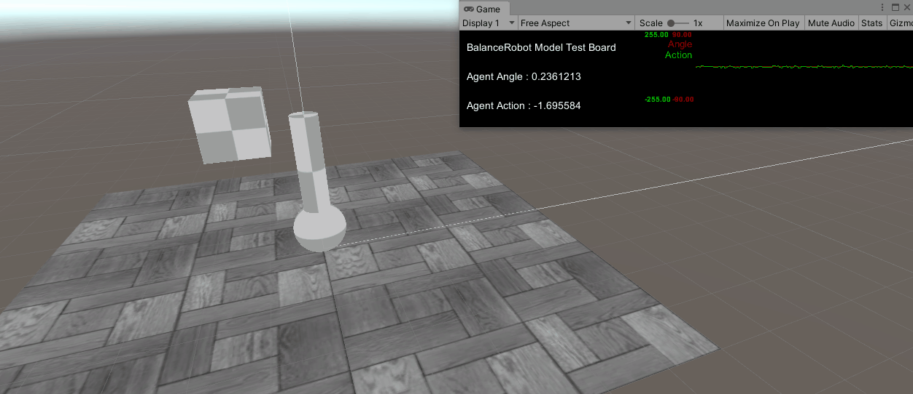

# Self-Balancing-Robot
Implementation of Self Balancing Robot with ML-Agents

RolyPoly model is Newly desinged model to reduce complexity and i use this model implement the balance robot on real world.

## RolyPoly Model

## Requirements
*   ml-agents >= 1.4.0

## Usage
### train
1. import Assets in your unity.
2. build RolyPoly scenes and train with default option.
### test model
1. import Assets in your unity.
2. select RolyPolyModeltest scenes and start the game
### test real
1. import Assets in your unity.
2. select RolyPolyRealtest scenes and start the game (please don't forget the upload and connect to arduino)

## Results
### training result

### Implementation result
https://www.youtube.com/watch?v=zNuGCi0jJcc

## References
Kalmanfilter

https://github.com/TKJElectronics/KalmanFilter

https://github.com/prozoroff/UKFSharp

PID

http://scipia.co.kr/blog/227

## Contect

titania7777@seoultech.ac.kr or titania7777@gmail.com