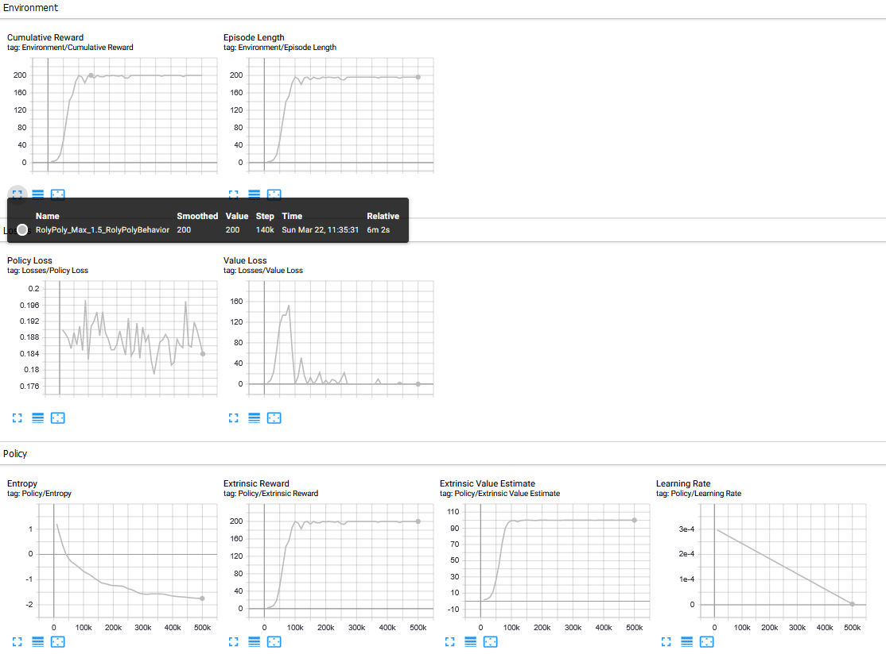

# Self-Balancing-Robot
Implementation of Self Balancing Robot with ML-Agents

## Requirements
*   ml-agents >= 1.4.0

## Usage
### train
1. import Assets in your unity.
2. build RolyPoly Scenes and train with default option.
### test model
1. import Assets in your unity.
2. select RolyPolyModeltest and start the game
### test real
1. import Assets in your unity.
2. select RolyPolyRealtest and start the game (please don't forget the upload and connect to arduino)

## Results
### training result

### Implementation result
https://www.youtube.com/watch?v=zNuGCi0jJcc

## Contect

titania7777@seoultech.ac.kr or titania7777@gmail.com